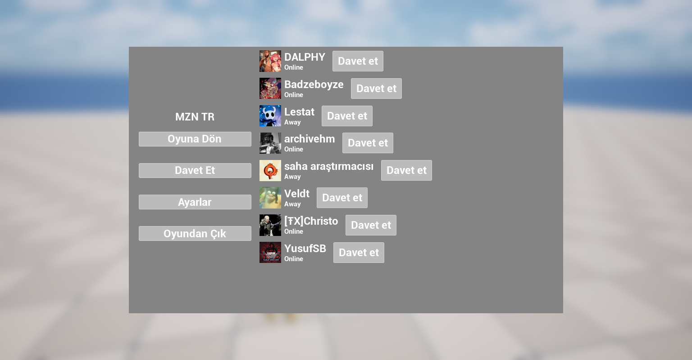

  

## About the Project

A multiplayer co-op shooter developed with Unreal Engine.

The project uses Steam for online multiplayer functionality and focuses on cooperative gameplay between players.

## Features

- 🎮 Online Co-op Multiplayer
- 🌐 Steam Online Sessions
- 🔫 Multiplayer Weapon System
- 👥 Character Replication
- 🖥️ Client-Server Architecture
- 💻 Unreal Engine
- ⚙️ C++

## Technologies

- Unreal Engine
- C++
- Steam
- Git / GitHub

Steam Friend Invite Menu :

  

